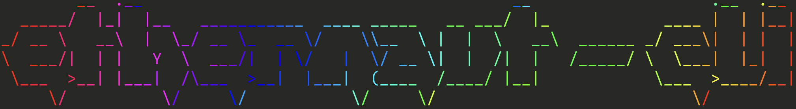

## What is it?

A universal Ethereum swiss army knife with an AI duck taped onto it.

A CLI for non-technical users, trying to bridge the gap between graphical UIs and CLIs.

A framework for rapid tool building; integrate a new tool in a matter of hours.

An extensible framework composed of [hardhat](https://github.com/NomicFoundation/hardhat) plugins.

Example usages:

`ethernaut what is the total supply of USDC`

or

`ethernaut complete level 2 of the ethernaut challenges`

It can also be used as a regular cli:

`ethernaut util unit 5 --from ether --to wei`

And also features an interactive mode that allows easy navigation of tasks and collection of task arguments.

## Installation

This CLI is mean to be installed globally, and not as a per-project task runner as hardhat is normally used for.

`npm i -g ethernaut-cli`

## Tutorials and articles

- [Announcing the ethernaut-cli](https://mirror.xyz/theethernaut.eth/0HP3L4mWzb4isXYERfsncBQgzT1T99uQTH8tvJvICmE)

## Intuitive navigation

No more man pages. No more --help.

Just type `ethernaut` and jump straight into an enquirer based navigation mode. Select a scope, select a task, and boom.

  
Navigation demo

  

## Smart interactive mode

Once in a task, interactive mode kicks in, and parameters are collected through enquirer prompts.

  
Enquirer param collection

  

## Normal CLI interaction

This is still a regular CLI app, so commands can be called without all the fancy ui or ai stuff:

  
Normal CLI mode

  

## Ui extensions

Plugins of plugins? Why not.

Plugins that enhance parameter collection prompts in other plugins with even cooler prompts, smart suggestions, etc.

For example, the ui extension of the interact plugin can fetch the abi from Etherscan if you didn't provide an abi:

  
Custom ABI Prompt

  

But after you've interacted with the contract, it already has the abi, so the abi is instead suggested:

  
Abi suggestion

  

Another example is the extension for the model param in `ethernaut ai config --model`, which queries the openai API and presents a list of available models.

## Natural language to cli commands

If that wasn't easy enough, just type whatever you want and AI will kick in to try to make sense of what you typed, and the right command or sequence of commands will be executed.

  
Ai natural language interpretation

  

You want the AI to also teach you how the commands work? Sure.

  
Ai command explanation

  

You want the AI to also teach you about Ethereum. Also sure.

  
Complete level 1

  

## Extensibility through hardhat plugins

You don't have to use this entire plethora of features tho. You can use a single feature in your regular hardhat project with exactly what you need. This is because the ethernaut-cli is completely built with hardhat plugins.

You just want task navigation and interactive mode in your project: use the `ethernaut-ui` plugin.

Or the ai stuff: use `ethernaut-ai` plugin.

All the plugins combined conform the ethernaut-cli.

List of packages

| Title                                                             | Description                                                             |
| ----------------------------------------------------------------- | ----------------------------------------------------------------------- |
| [ethernaut-ai](packages/ethernaut-ai/README.md)                   | AI assistant that interprets user input and executes hardhat tasks      |
| [ethernaut-ai-ui](packages/ethernaut-ai-ui/README.md)             | Ui extensions for the ethernaut-ai package                              |
| [ethernaut-cli](packages/ethernaut-cli/README.md)                 | Main hardhat project                                                    |
| [ethernaut-challenges](packages/ethernaut-challenges/README.md)   | Tasks for playing the Open Zeppelin Ethernaut challenges from the CLI   |
| [ethernaut-common](packages/ethernaut-common/README.md)           | Common utils used by several ethernaut-cli plugins                      |
| [ethernaut-interact](packages/ethernaut-interact/README.md)       | Tasks for sending transactions and interacting with contracts           |
| [ethernaut-interact-ui](packages/ethernaut-interact-ui/README.md) | Ui extensions for the ethernaut-interact package                        |
| [ethernaut-network](packages/ethernaut-network/README.md)         | Tasks for interacting with different networks                           |
| [ethernaut-network-ui](packages/ethernaut-network-ui/README.md)   | Ui extensions for the ethernaut-network package                         |
| [ethernaut-ui](packages/ethernaut-ui/README.md)                   | Intuitive navigation and interactive param collection for hardhat tasks |
| [ethernaut-util](packages/ethernaut-util/README.md)               | Simple, everyday utilities for Ethereum devs                            |
| [ethernaut-util-ui](packages/ethernaut-util-ui/README.md)         | Ui extensions for the ethernaut-util package                            |
| [ethernaut-wallet](packages/ethernaut-wallet/README.md)           | Tasks for interacting from different Ethereum accounts                  |
| [ethernaut-wallet-ui](packages/ethernaut-wallet-ui/README.md)     | Ui extensions for the ethernaut-wallet package                          |

